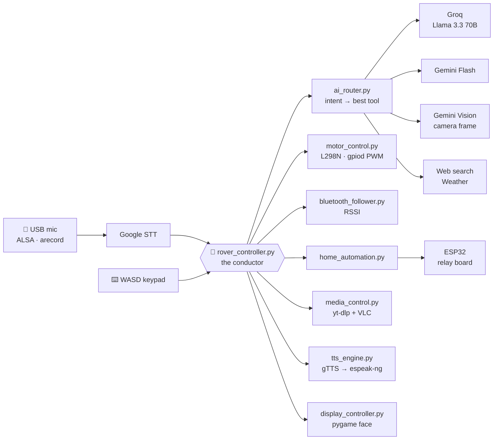
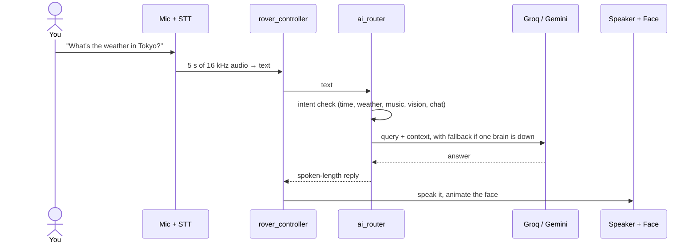

<div align="center">


<a href="https://git.io/typing-svg"></a>

<br/>

[](https://www.raspberrypi.com/)
[](https://python.org)
[](https://groq.com)
[](https://deepmind.google/technologies/gemini/)
[](https://www.espressif.com/)
[](LICENSE)

**[Briefing](#-mission-briefing) · [Demo](#-demo) · [Architecture](#-architecture) · [Voice Commands](#-voice-commands) · [Hardware](#-hardware) · [Quick Start](#-quick-start) · [Roadmap](#-roadmap)**

</div>

---

## 🎯 Mission Briefing

**GOKU** is a voice-controlled rover that patrols, listens, thinks, and talks back. It is built on a **Raspberry Pi 5** with an **ESP32** relay node riding along for home automation.

Say what you want in plain English:

- 🚗 *"Forward five seconds"*: it drives.
- 📡 *"Follow me"*: it tracks your phone by Bluetooth signal strength and keeps its distance.
- 👁️ *"What do you see?"*: it grabs a camera frame and asks a vision model.
- 💡 *"Lights on"*: it tells an ESP32 to click a relay.
- 🎵 *"Play a song"*: it finds it on YouTube and plays it through VLC.
- 🧠 *"Who is…?"*: it routes the question to **Groq** or **Gemini**, whichever is up.
- 📧 *Something's wrong?* It can email you a security alert.

Meanwhile a 60 FPS pygame robot face blinks, scans, and pulses on its HDMI screen so you always know what it's up to.

```
      ┌───────────────────┐
      │   ◉           ◉   │     LED eyes: glow · blink · scan
      │                   │
      │      ▁▂▃▂▁        │     waveform while speaking
      └───────────────────┘
```

---

## 🎬 Demo

> Demo video and photos are on the way. ⭐ Star the repo to catch the drop.

<!--
Add your media here, then delete this comment:


| The rover | The face HUD | The relay board |
|---|---|---|
|  |  |  |
-->

---

## 🧰 Systems Online

| System | What it does | Where it lives |
|---|---|---|
| 🧠 **Cortex** | Detects intent, then routes to time, weather, music, vision, search, or chat. Groq and Gemini back each other up. | `ai_router.py` `groq_assistant.py` `gemini_assistant.py` |
| 🎤 **Ears & Voice** | Records with ALSA `arecord`, transcribes with Google STT, and replies with gTTS (espeak-ng offline fallback). | `speech_handler.py` `tts_engine.py` |
| 🚗 **Locomotion** | L298N dual-motor driver using software PWM through `libgpiod`. | `motor_control.py` |
| 📡 **Shadow Mode** | Follows a paired Bluetooth device by RSSI zones (too close, optimal, too far). | `bluetooth_follower.py` |
| 👁️ **Vision** | Picamera2 (CSI) with an OpenCV fallback, plus Gemini Vision scene descriptions. | `camera_stream.py` `gemini_vision.py` |
| 🏠 **Home Control** | Finds the ESP32 on the LAN by MAC address and drives relays over HTTP. | `home_automation.py` `esp32_8channel.ino` |
| 🎵 **Media** | YouTube search via `yt-dlp`, playback and control through VLC. | `media_control.py` |
| ⏰ **Clocks** | Voice-set alarms and pausable timers with generated WAV tones. | `alarm_system.py` `timer_system.py` `ringtone_manager.py` |
| 🚨 **Alerts** | Gmail SMTP security notifications. | `email_notifier.py` |
| 🎭 **Face** | Animated robot HUD at 800×480. | `display_controller.py` |
| ⌨️ **Manual override** | WASD driving from the terminal, alongside voice. | `keypad_controller.py` |

---

## 🧬 Architecture



### The life of one voice command



---

## 🎤 Voice Commands

Just talk naturally. A few things it understands:

| Category | Try saying |
|---|---|
| 🚗 **Move** | *forward · backward · left · right · stop · reverse · forward 5 seconds* |
| 🔭 **Scan** | *scan · investigate · look around* |
| 📡 **Follow** | *follow me · stop following · save my device* + the Bluetooth MAC |
| 💡 **Home** | *lights on/off · fan on/off · pump on/off · AC on/off · all off* |
| 👁️ **Vision** | *what do you see? · describe the room · read the text · how many fingers?* |
| 🌤️ **Info** | *weather in [city] · what time is it? · search for [topic] · who is [person]?* |
| 🎵 **Media** | *play [song] · pause · resume · stop* |
| ⏰ **Clocks** | *set alarm for 07:00 · set timer for 5 minutes · list alarms* |

### 🎮 Keyboard mode

Runs alongside voice, straight from the terminal:

| Key | Action | Key | Action |
|---|---|---|---|
| `W` | Forward | `Space` | Stop |
| `S` | Backward | `Q` | Exit keypad mode |
| `A` | Left | `Ctrl+C` | Shut everything down |
| `D` | Right | | |

---

## 🔩 Hardware

| Part | Role |
|---|---|
| **Raspberry Pi 5** | The brain, running Raspberry Pi OS (64-bit) |
| **L298N motor driver** + 2 DC motors | Locomotion (12 V drivetrain) |
| **Pi Camera (CSI)** or USB camera | Vision |
| **800×480 HDMI display** | The robot face |
| **USB microphone** + speaker | Ears and voice |
| **ESP32 dev board** + relay module | Lights, fan, pump, AC |

<details>
<summary><b>📍 Raspberry Pi GPIO map (BCM numbering)</b></summary>

<br/>

| GPIO | Signal | Connected to |
|---|---|---|
| `5` | IN1 | Motor A + |
| `6` | IN2 | Motor A − |
| `13` | IN3 | Motor B + |
| `19` | IN4 | Motor B − |
| `26` | ENA (PWM) | Motor A speed |
| `16` | ENB (PWM) | Motor B speed |

</details>

<details>
<summary><b>🔌 ESP32 relay map</b></summary>

<br/>

| Relay | ESP32 pin | Device |
|---|---|---|
| 1 | `D13` | 💡 Light 1 |
| 2 | `D12` | 🌬️ Fan |
| 3 | `D14` | 🚰 Pump motor |
| 4 | `D27` | ❄️ AC |
| 5 | `D26` | 💡 Light 2 |

An 8-channel firmware (`esp32_8channel.ino`) and a 5-relay variant (`esp32_home_auto/`) are included.

</details>

**Power:** 12 V @ 2 A for the drivetrain, 5 V @ 3 A for the Pi, 5 V USB for the ESP32.

> [!WARNING]
> The relays switch real appliances. Use an opto-isolated relay module, keep mains wiring enclosed and insulated, and never work on it while it's plugged in.

---

## 🚀 Quick Start

### 1. Clone and install

```bash
git clone https://github.com/saivikrambalaji2004/goku_4.git
cd goku_4

# System packages (Raspberry Pi OS)
sudo apt install -y python3-gpiod python3-picamera2 espeak-ng vlc alsa-utils bluez pulseaudio-utils

# Python environment (system-site-packages lets the venv see gpiod and picamera2)
python3 -m venv venv --system-site-packages
source venv/bin/activate
pip install -r requirements.txt
pip install gTTS edge-tts Pillow numpy yt-dlp
```

### 2. Add your keys (never commit these)

```bash
export GROQ_API_KEY="your-groq-key"
export GOOGLE_API_KEY="your-gemini-key"
export GOOGLE_VISION_API_KEY="your-gemini-key"   # can be the same key
export EMAIL_SENDER="you@gmail.com"
export EMAIL_PASSWORD="your-gmail-app-password"
export EMAIL_RECIPIENT="alerts@example.com"
export ESP32_IP="192.168.1.100"
```

Two more things to check:

- Set your ESP32's MAC address in `config.py` so GOKU can find it even when DHCP changes its IP.
- Find your USB mic with `arecord -l` and update the ALSA device in `speech_handler.py` (default `plughw:2,0`).

### 3. Flash the ESP32

Open `esp32_8channel.ino` in the Arduino IDE, choose **ESP32 Dev Module**, add your Wi-Fi credentials, and upload over USB. Wire the relays, then power-cycle the board.

### 4. Wake GOKU up

```bash
sudo ./venv/bin/python3 main.py
```

`sudo` is there for direct GPIO access. Wait for the robot face to say *"Goku online. All systems ready."* and start talking.

---

## 🩺 Diagnostics

Hardware acting up? These scripts test each piece on its own:

```bash
sudo python3 diagnose_all.py      # every GPIO pin, original vs. alternate sets
sudo python3 diagnose_motors.py   # motor pins and a forward pattern
sudo python3 pin_diagnostic.py    # per-pin HIGH/LOW check with a multimeter
python3 find_esp32.py             # scan the LAN for the ESP32
```

---

## 🛠️ Engineering Notes: what broke, and how it got fixed

| Problem | What I did |
|---|---|
| **Pi 5 GPIO refused to behave.** The original motor pins misbehaved. | Wrote diagnostic scripts, tested both pin sets, and moved to GPIO 5, 6, 13, 19, 26, 16. PWM must start *before* direction is set, and both enable pins must be live. |
| **PyAudio kept segfaulting.** | Dropped it. Audio is recorded with ALSA's `arecord` CLI and fed to the recognizer as a WAV file. |
| **ALSA spammed the console.** | Installed a no-op error handler through `ctypes` before pygame loads. |
| **The ESP32 changes IP on every DHCP lease.** | `home_automation.py` finds it by MAC through the ARP table, then falls back to sweeping likely IPs. |
| **LLM quotas and outages.** | Dual-model routing with fallback, plus retry-with-backoff on Gemini quota errors. |
| **No internet means no voice.** | gTTS for natural speech, with espeak-ng as an offline fallback. |

<details>
<summary><b>📂 Project map</b></summary>

```
goku_4/
├── main.py                  # entry point: signal handlers → rover_controller
├── rover_controller.py      # the conductor: init, command loop, shutdown
├── config.py                # pins, models, timings
│
├── ai_router.py             # intent detection → time / weather / music / vision / chat
├── groq_assistant.py        # Llama 3.3 70B via Groq
├── gemini_assistant.py      # Gemini text
├── gemini_vision.py         # Gemini vision with quota retry
├── web_search.py            # DuckDuckGo lookups
│
├── speech_handler.py        # arecord → Google STT
├── tts_engine.py            # gTTS → espeak-ng
├── edge_tts_helper.py       # Edge TTS voice helper
│
├── motor_control.py         # L298N driver, libgpiod software PWM
├── bluetooth_follower.py    # RSSI-based "follow me"
├── navigation.py            # trajectory planning (obstacle detection is WIP)
├── keypad_controller.py     # WASD manual override
│
├── home_automation.py       # ESP32 discovery + HTTP relay control
├── esp32_8channel.ino       # 8-relay firmware
├── esp32_home_auto/         # 5-relay variant
│
├── camera_stream.py         # Picamera2 → OpenCV fallback
├── display_controller.py    # pygame robot-face HUD
├── media_control.py         # yt-dlp + VLC
├── weather_module.py        # wttr.in
├── alarm_system.py          # threaded alarm clock
├── timer_system.py          # pausable countdown timers
├── ringtone_manager.py      # generates alarm/timer WAVs
├── email_notifier.py        # Gmail SMTP alerts
├── goku_utils.py            # logging, retry, buffers
├── alsa_suppress.py         # silence ALSA warnings
│
├── piper_models/            # local ONNX TTS voices (experimental)
├── ringtones/               # generated WAV tones
├── requirements.txt
├── run.sh · run_goku.sh     # launch scripts
│
└── 🦴 the fossil record (early prototypes and hardware debugging)
    ├── voice_rover.py · voice_rover_fixed.py · voice_rover_final.py
    ├── motor_alt_pins.py · config_new.py
    ├── fix_motors.py · final_motor_fix.py
    └── diagnose_all.py · diagnose_motors.py · pin_diagnostic.py · find_esp32.py
```

</details>

---

## 🧭 Roadmap

- [x] Voice pipeline with dual-LLM routing and fallback
- [x] Bluetooth RSSI following
- [x] ESP32 relay control with MAC-based discovery
- [x] Animated robot-face HUD
- [ ] Sensor-driven obstacle avoidance (the hooks in `navigation.py` are stubs waiting for sensors)
- [ ] Vision-based person following, to replace the Bluetooth RSSI approach
- [ ] Wake word and offline speech recognition
- [ ] Web dashboard with a live camera feed
- [ ] Secrets in a `.env` file, plus unit tests and CI
- [ ] Move early prototypes into a `prototypes/` folder

---

## 🔐 Security & Privacy

- API keys, the Gmail app password, and other credentials belong in **environment variables or a git-ignored `.env`**, never in the repo.
- ESP32 relays are controlled over the **local network only**.
- Bluetooth following reads **signal strength only**. No data leaves the device.
- GOKU has a camera and a microphone. Run it only in spaces you own or where everyone has agreed to it.

---

## 👤 Built by

**Sai**: Electronics & Communication Engineering student, working on embedded systems, IoT, and software.
GitHub: [@saivikrambalaji2004](https://github.com/saivikrambalaji2004)

Found a bug or have an idea? Open an issue or a pull request.

## 📜 License

Released under the **MIT License**. See [`LICENSE`](LICENSE).

<div align="center">


*Built with soldering fumes, too much coffee, and a healthy disrespect for* `sudo`.

</div>
